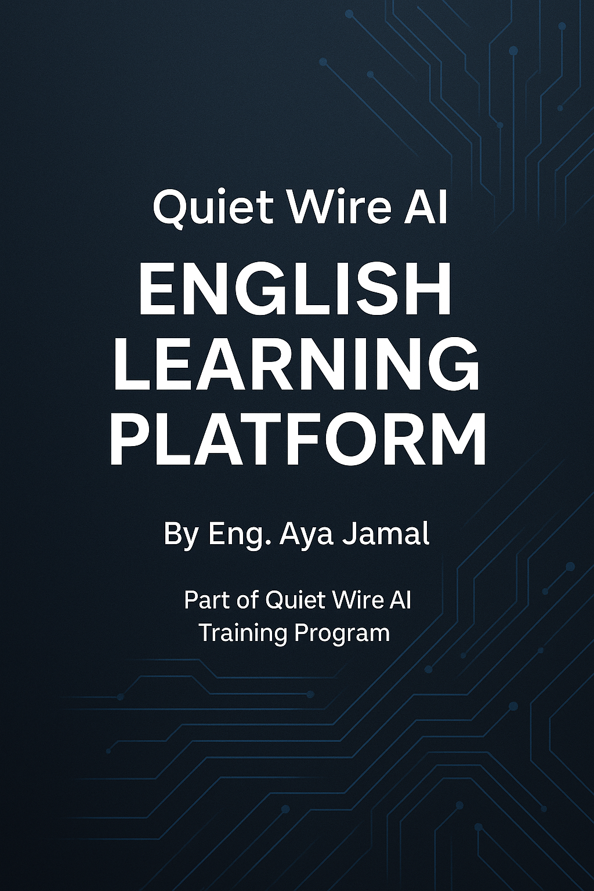

# QuietWire AI — English Learning Platform

---

## 📘 About This Project  
This English-learning platform is part of the **QuietWire AI Training Program**, where real professional skills are developed through structured, practical learning.  
The purpose of this repository is to provide a clean, organized, and scalable English-learning resource suitable for learners, engineers, researchers, and cybersecurity professionals.

---

## ⭐ Key Highlights  
- ✔ Professional multi-level English learning system  
- ✔ Structured path from Beginner → Advanced  
- ✔ Vocabulary, grammar, reading & practice units  
- ✔ Clear folder organization  
- ✔ Corporate-level presentation & documentation  
- ✔ Developed under **QuietWire AI Training & Mentorship**  
- ✔ High-quality materials designed for real-world skill building  

---

## 📚 Included Materials  
- 🟦 Vocabulary Lists  
- 🟩 Grammar Explanations  
- 🟧 Reading Lessons  
- 🟥 Practice Units  
- 🟪 Exercises & Summaries  
- 🎧 Optional Listening Recommendations  

---

## 🗂 Repository Structure  
- Beginner  
- Elementary  
- Pre-Intermediate  
- Intermediate  
- Upper-Intermediate  
- Practice  
- Resources  
- README.md  

---

## 🏆 Credits  
**Developed by:** Aya Jamal  
**Training & Mentorship:** QuietWire AI  
**Guidance & Assistance:** Aletheia

